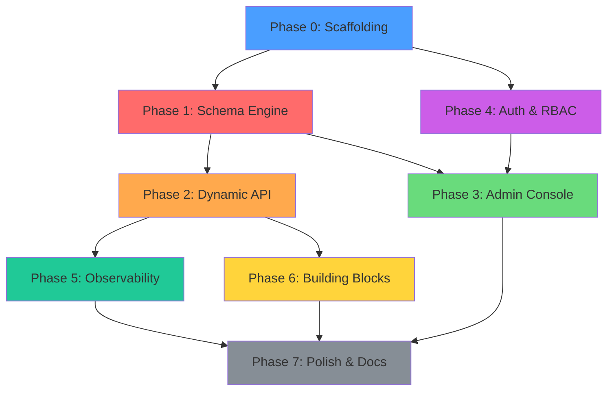

# Ion Drive — Implementation Plan

> [!NOTE]
> Phases 0–10 below are **complete**. Future work (Phases 11+) and the full findings backlog
> from the 2026-07-06 post-Phase-10 review live in [roadmap.md](roadmap.md).

## Goal

Build Ion Drive: an open-source, self-hosted platform for accelerated custom business software development. The platform provides runtime-dynamic data objects backed by PostgreSQL, automatic REST/GraphQL/MCP API surface, an admin console, pluggable auth, built-in observability, and a shadcn-style building blocks system.

---

## User Review Required

> [!IMPORTANT]
> **Framework Choice:** I'm recommending **Fastify** over NestJS. NestJS's decorator/module system actively fights against dynamic route registration, which is our core mechanic. Fastify's plugin system is purpose-built for this. See [tech_stack_decisions.md](file:///C:/Users/Jared/.gemini/antigravity-ide/brain/a7aef560-5a08-4040-98d0-cd8c51de41cb/tech_stack_decisions.md) for full rationale.

> [!IMPORTANT]
> **Auth Choice:** I'm recommending **Better Auth** as the default (fully self-hosted, data in your DB, no per-user fees) with a pluggable adapter interface so WorkOS/Auth0/Clerk can be swapped in. This aligns with "self-hosted Firebase" better than defaulting to a SaaS auth provider.

> [!IMPORTANT]
> **ORM/Query Builder:** Recommending **Kysely** over Prisma/Drizzle. Prisma can't handle dynamic schemas at runtime (static `.prisma` file). Drizzle requires workarounds. Kysely's Schema Builder API and raw SQL support are purpose-built for our DDL-at-runtime use case.

> [!NOTE]
> **GraphQL Engine (RESOLVED):** Shipped in Phase 2 with **graphql-js directly + graphql-yoga**, not Pothos. Pothos's benefit is compile-time type inference, which is moot for objects defined at runtime; graphql-js type constructors express a reflected schema more cleanly. See [ADR-009](research/architecture-decisions.md). Apollo/type-graphql remain unsuitable (static decorators).

---

## Open Questions

> [!IMPORTANT]
> **1. Licensing?** MIT is the most permissive and community-friendly. Apache 2.0 provides patent protection. AGPL forces derivatives to open-source. What's the preference? I'd recommend **MIT** for maximum adoption, but Apache 2.0 is also strong.

> [!IMPORTANT]
> **2. Multi-tenancy model:** The requirements say "isolated database per tenant." Should we also support a lighter-weight **schema-per-tenant** mode (PostgreSQL schemas within one DB) for users who want simpler deployments? I'd recommend supporting both, with DB-per-tenant as default.

> [!IMPORTANT]
> **3. Admin console scope for MVP:** Should the initial admin console include the full Airtable-like data grid (inline editing, row-level operations), or start with a simpler form-based CRUD and iterate? The data grid is significant engineering effort.

> [!IMPORTANT]
> **4. Building blocks in MVP?** The building blocks system is a major feature. Should we include it in the initial release, or ship a solid core first and add blocks in a fast follow? I'd recommend shipping the CLI infrastructure in v1 but deferring the marketplace.

> [!IMPORTANT]
> **5. Organization name:** The workspace is `ionshift/ion-drive`. Is `ion-shift` the org and `ion-drive` the product? Should npm packages be `@ionshift/ion-drive-core`, `@ionshift/ion-drive`, etc.?

---

## Proposed Changes

The implementation is organized into 7 phases. Phases are sequential but many work streams **within** each phase can be parallelized across agents.

```mermaid
gantt
    title Ion Drive Implementation Phases
    dateFormat X
    axisFormat %s
    
    section Foundation
    Phase 0 - Scaffolding        :p0, 0, 1
    
    section Core Engine
    Phase 1 - Schema Engine      :p1, after p0, 3
    Phase 2 - Dynamic API        :p2, after p1, 3
    
    section Interface & Auth
    Phase 3 - Admin Console      :p3, after p1, 4
    Phase 4 - Auth & RBAC        :p4, after p0, 2
    
    section Platform
    Phase 5 - Observability      :p5, after p2, 2
    Phase 6 - Building Blocks    :p6, after p2, 3
    
    section Launch
    Phase 7 - Polish & Docs      :p7, after p5, 2
```



---

### Phase 0: Project Scaffolding

Set up the monorepo, tooling, CI, and project structure.

**Can be done by: 1 agent**

#### [NEW] Root Configuration

| File | Purpose |
|:---|:---|
| `package.json` | Root package.json with workspace config |
| `pnpm-workspace.yaml` | Workspace definition |
| `turbo.json` | Turborepo pipeline config |
| `tsconfig.base.json` | Shared TypeScript config |
| `biome.json` | Linting + formatting |
| `.gitignore` | Standard ignores |
| `README.md` | Project overview |
| `LICENSE` | License file (pending decision) |
| `.github/workflows/ci.yml` | CI pipeline (lint, test, build) |

#### [NEW] `packages/core/`

| File | Purpose |
|:---|:---|
| `package.json` | Core package config (fastify, kysely, zod deps) |
| `tsconfig.json` | TypeScript config extending base |
| `src/index.ts` | Main entry point |
| `src/server.ts` | Fastify server setup |
| `src/config/index.ts` | Configuration loading (env, files) |
| `vitest.config.ts` | Test configuration |

#### [NEW] `packages/admin/`

| File | Purpose |
|:---|:---|
| `package.json` | Admin console (react, vite deps) |
| `tsconfig.json` | TypeScript config |
| `vite.config.ts` | Vite configuration |
| `index.html` | SPA entry point |
| `src/main.tsx` | React entry |
| `src/App.tsx` | Root component |

#### [NEW] `packages/cli/`

| File | Purpose |
|:---|:---|
| `package.json` | CLI package |
| `tsconfig.json` | TypeScript config |
| `src/index.ts` | CLI entry point (commander.js) |

#### [NEW] `docker/`

| File | Purpose |
|:---|:---|
| `docker-compose.yml` | Dev environment (Postgres + Ion Drive) |
| `docker-compose.observability.yml` | Grafana stack overlay |
| `Dockerfile` | Multi-stage production build |

---

### Phase 1: Schema Engine ⚡ *Critical Path*

The heart of Ion Drive. Runtime schema management with PostgreSQL DDL operations.

**Can be parallelized: 3 agents** (Schema Manager, Metadata Store, Validation Engine)

#### [NEW] `packages/core/src/schema/`

##### Schema Manager (Agent 1)
| File | Purpose |
|:---|:---|
| `schema-manager.ts` | Orchestrator for all schema operations |
| `ddl-executor.ts` | Executes DDL (CREATE/ALTER/DROP TABLE) via Kysely |
| `column-types.ts` | Comprehensive column type registry (text, int, decimal, boolean, date, datetime, json, uuid, enum, etc.) |
| `relationship-manager.ts` | Manages FK relationships (1:1, 1:M, M:M with junction tables) |
| `index-manager.ts` | Auto-generates indexes (FKs, unique constraints) + user-defined |
| `migration-generator.ts` | Generates migration SQL from schema diff |

##### Metadata Store (Agent 2)
| File | Purpose |
|:---|:---|
| `metadata-store.ts` | Stores object definitions in system tables (Kysely typed) |
| `metadata-types.ts` | TypeScript types for object/field/relationship definitions |
| `system-tables.ts` | Bootstrap system tables (`_ion_objects`, `_ion_fields`, `_ion_relationships`, `_ion_migrations`) |
| `schema-registry.ts` | In-memory cache of current schema state |

##### Validation Engine (Agent 3)
| File | Purpose |
|:---|:---|
| `change-validator.ts` | Validates proposed schema changes before execution |
| `impact-analyzer.ts` | Detects data loss, broken FKs, constraint violations |
| `change-preview.ts` | Generates human-readable preview of proposed changes |
| `change-set.ts` | Atomic change set (multiple operations in one transaction) |

##### Shared
| File | Purpose |
|:---|:---|
| `types.ts` | Core schema types (DataObject, Field, Relationship, ColumnType, etc.) |

#### System Tables Schema

```sql
-- Ion Drive system tables (managed by Kysely typed layer)

CREATE TABLE _ion_objects (
  id UUID PRIMARY KEY DEFAULT gen_random_uuid(),
  name VARCHAR(255) NOT NULL UNIQUE,
  display_name VARCHAR(255) NOT NULL,
  description TEXT,
  table_name VARCHAR(255) NOT NULL UNIQUE,
  is_system BOOLEAN DEFAULT false,
  created_at TIMESTAMPTZ DEFAULT NOW(),
  updated_at TIMESTAMPTZ DEFAULT NOW()
);

CREATE TABLE _ion_fields (
  id UUID PRIMARY KEY DEFAULT gen_random_uuid(),
  object_id UUID NOT NULL REFERENCES _ion_objects(id) ON DELETE CASCADE,
  name VARCHAR(255) NOT NULL,
  display_name VARCHAR(255) NOT NULL,
  column_name VARCHAR(255) NOT NULL,
  column_type VARCHAR(50) NOT NULL,  -- maps to ColumnType enum
  is_required BOOLEAN DEFAULT false,
  is_unique BOOLEAN DEFAULT false,
  is_indexed BOOLEAN DEFAULT false,
  default_value TEXT,
  constraints JSONB,  -- min/max, regex, enum values, etc.
  sort_order INT DEFAULT 0,
  created_at TIMESTAMPTZ DEFAULT NOW(),
  updated_at TIMESTAMPTZ DEFAULT NOW(),
  UNIQUE(object_id, name)
);

CREATE TABLE _ion_relationships (
  id UUID PRIMARY KEY DEFAULT gen_random_uuid(),
  name VARCHAR(255) NOT NULL,
  type VARCHAR(20) NOT NULL,  -- 'one_to_one', 'one_to_many', 'many_to_many'
  source_object_id UUID NOT NULL REFERENCES _ion_objects(id),
  target_object_id UUID NOT NULL REFERENCES _ion_objects(id),
  source_field_id UUID REFERENCES _ion_fields(id),
  target_field_id UUID REFERENCES _ion_fields(id),
  junction_table VARCHAR(255),  -- for M:M
  cascade_delete BOOLEAN DEFAULT false,
  created_at TIMESTAMPTZ DEFAULT NOW()
);

CREATE TABLE _ion_migrations (
  id UUID PRIMARY KEY DEFAULT gen_random_uuid(),
  version INT NOT NULL,
  description TEXT,
  sql_up TEXT NOT NULL,
  sql_down TEXT,
  applied_at TIMESTAMPTZ DEFAULT NOW(),
  applied_by VARCHAR(255)
);
```

---

### Phase 2: Dynamic API Surface ✅ *Complete*

Auto-generate REST, GraphQL, and MCP endpoints from schema definitions.

> [!NOTE]
> **Status: Complete (2026-07-03).** All four surfaces are wired into `server.ts` and verified end-to-end against Postgres. Implemented via **runtime reflection** rather than per-object route/type registration ([ADR-009](research/architecture-decisions.md)): REST uses parameterized catch-all routes, GraphQL caches a registry-version-keyed schema, MCP runs stateless Streamable HTTP. GraphQL uses graphql-js + graphql-yoga (not Pothos). Actual layout differs slightly from the file table below (e.g. `graphql/{scalars,resolver-factory,schema-builder,plugin}.ts`, `mcp/plugin.ts`); the table records the original plan.

**Can be parallelized: 4 agents** (REST, GraphQL, MCP, OpenAPI)

#### [NEW] `packages/core/src/api/`

##### REST API Generator (Agent 1)
| File | Purpose |
|:---|:---|
| `rest/route-generator.ts` | Generates Fastify routes for each data object |
| `rest/crud-handler.ts` | Generic CRUD handler factory |
| `rest/query-parser.ts` | Parse filter, sort, pagination from query params |
| `rest/response-formatter.ts` | Consistent response envelope |
| `rest/bulk-operations.ts` | Batch create/update/delete |

Generated routes per object:
```
GET    /api/v1/:objectName          # List (paginated, filtered, sorted)
GET    /api/v1/:objectName/:id      # Get by ID (with relationship expansion)
POST   /api/v1/:objectName          # Create
PUT    /api/v1/:objectName/:id      # Update
PATCH  /api/v1/:objectName/:id      # Partial update
DELETE /api/v1/:objectName/:id      # Delete
POST   /api/v1/:objectName/bulk     # Bulk operations
```

##### GraphQL API Generator (Agent 2)
| File | Purpose |
|:---|:---|
| `graphql/schema-builder.ts` | Builds Pothos GraphQL schema from runtime objects |
| `graphql/type-builder.ts` | Creates GraphQL types dynamically |
| `graphql/resolver-factory.ts` | Generic resolver factory for CRUD |
| `graphql/connection-types.ts` | Relay-style pagination |
| `graphql/plugin.ts` | Fastify plugin for GraphQL (via Yoga) |

##### MCP Server (Agent 3)
| File | Purpose |
|:---|:---|
| `mcp/server.ts` | MCP server implementation (Streamable HTTP transport) |
| `mcp/tools.ts` | Tool definitions for schema introspection + CRUD |
| `mcp/resources.ts` | MCP resources (schema definitions as context) |
| `mcp/prompts.ts` | Pre-built prompts for common operations |

MCP Tools (auto-generated per object):
```
- ion_list_objects          # List all data objects and their schemas
- ion_describe_object       # Get full schema for one object
- ion_{object}_list         # List records with filtering
- ion_{object}_get          # Get a single record
- ion_{object}_create       # Create a record
- ion_{object}_update       # Update a record
- ion_{object}_delete       # Delete a record
- ion_schema_preview        # Preview a schema change
- ion_schema_apply          # Apply a schema change
- ion_query                 # Run a custom filtered query
```

##### OpenAPI Generator (Agent 4)
| File | Purpose |
|:---|:---|
| `openapi/spec-generator.ts` | Generates OpenAPI 3.1 spec from current schema |
| `openapi/schema-mapper.ts` | Maps Ion Drive types to JSON Schema |
| `openapi/endpoint.ts` | Serves spec at `/api/v1/openapi.json` |

---

### Phase 3: Admin Console ✅ *Complete (functional)*

React SPA for platform configuration and monitoring.

> [!NOTE]
> **Status: Complete (2026-07-04), functional-not-polished per direction.** React 19 + Vite SPA in `packages/admin`: Login, Dashboard, Objects list + designer, functional DataGrid (browse/create/edit/delete), Users (role assignment), Roles (permission editor), Secrets, Settings (API keys). TanStack Router/Query, hand-rolled UI primitives, Tailwind v4 tokens. See [ADR-011](research/architecture-decisions.md). Builds/typechecks/lints clean and browser-verified (signup→first-admin, dashboard, object designer creating a real object). The Airtable-grade grid is deferred to a later phase.

**Can be parallelized: 3 agents** (Layout/Shell, Data Object CRUD, Dashboard)

#### [NEW] `packages/admin/src/`

##### App Shell & Layout (Agent 1)
| File | Purpose |
|:---|:---|
| `components/layout/AppShell.tsx` | Main layout with sidebar + header |
| `components/layout/Sidebar.tsx` | Navigation sidebar |
| `components/layout/Header.tsx` | Top bar with user menu |
| `components/ui/` | shadcn/ui components (button, dialog, table, etc.) |
| `lib/api-client.ts` | Typed API client for Ion Drive backend |
| `lib/theme.ts` | Theme configuration (dark/light) |
| `router.tsx` | TanStack Router configuration |

##### Data Object Management (Agent 2)
| File | Purpose |
|:---|:---|
| `pages/objects/ObjectList.tsx` | List all data objects |
| `pages/objects/ObjectDesigner.tsx` | Visual schema designer (add fields, relationships) |
| `pages/objects/DataGrid.tsx` | Airtable-like data grid for browsing records |
| `pages/objects/RecordForm.tsx` | Form for creating/editing records |
| `pages/objects/SchemaPreview.tsx` | Preview modal for schema changes |
| `components/schema/FieldEditor.tsx` | Field property editor |
| `components/schema/RelationshipEditor.tsx` | Relationship configuration |
| `components/schema/ColumnTypeSelector.tsx` | Column type picker |

##### Dashboard & Monitoring (Agent 3)
| File | Purpose |
|:---|:---|
| `pages/dashboard/Dashboard.tsx` | Main dashboard with key metrics |
| `pages/dashboard/ApiMetrics.tsx` | API request metrics (via embedded Grafana or custom charts) |
| `pages/logs/LogViewer.tsx` | Log viewer (query Loki or built-in log stream) |
| `pages/settings/GeneralSettings.tsx` | Platform settings |
| `pages/settings/SecretsManager.tsx` | Encrypted secrets management |
| `pages/users/UserList.tsx` | User management |
| `pages/users/RoleEditor.tsx` | RBAC role/permission editor |

---

### Phase 4: Authentication & RBAC ✅ *Complete*

Pluggable auth with Better Auth default, RBAC for API access.

> [!NOTE]
> **Status: Complete (2026-07-04), verified end-to-end.** Better Auth behind a pluggable `AuthProvider`; RBAC + API keys + AES-256-GCM secrets are Ion-Drive-owned. Enforcement gated by `ION_REQUIRE_AUTH`. First signup auto-becomes admin. See [ADR-010](research/architecture-decisions.md). 30 unit tests + a 12-check live smoke pass.

**Can be parallelized: 2 agents** (Auth Core, RBAC Engine)

#### [NEW] `packages/core/src/auth/`

##### Auth Core (Agent 1)
| File | Purpose |
|:---|:---|
| `auth-provider.ts` | AuthProvider interface definition |
| `better-auth-adapter.ts` | Better Auth implementation |
| `session-middleware.ts` | Fastify middleware for session validation |
| `api-key-manager.ts` | API key generation and validation |

##### RBAC Engine (Agent 2)
| File | Purpose |
|:---|:---|
| `rbac/role-manager.ts` | Role CRUD and assignment |
| `rbac/permission-engine.ts` | Permission evaluation (object-level, field-level) |
| `rbac/policy-types.ts` | Permission types (create, read, update, delete per object) |
| `rbac/middleware.ts` | Fastify hook for permission checks |

#### [NEW] `packages/core/src/config/`

##### Secrets Management
| File | Purpose |
|:---|:---|
| `secrets-manager.ts` | Encrypted secrets storage (AES-256-GCM) |
| `config-store.ts` | Configuration key-value store |
| `encryption.ts` | Encryption/decryption utilities |

---

### Phase 5: Observability & Scheduled Tasks ✅ *Complete*

Built-in telemetry and background task execution.

> [!NOTE]
> **Status: Complete (2026-07-04), verified end-to-end.** OpenTelemetry via **manual instrumentation** (`telemetry/`): `NodeSDK` lifecycle, global Fastify request spans + `ion.http.server.*` metrics, custom `ion.schema.*`/`ion.task.*` metrics, a pino→OTel log bridge, and an in-process Prometheus scrape endpoint at `/metrics`. Task engine (`tasks/`): `_ion_tasks`/`_ion_task_runs`, a handler registry (`noop`/`log`/`http_request`), an abort/timeout-guarded `TaskRunner`, and a **croner**-based `TaskScheduler` behind a `TaskEngine` facade, exposed at `/api/v1/tasks` (RBAC resource `tasks`). See [ADR-012](research/architecture-decisions.md). 12 new unit tests (42 core total) + a 20-check live smoke pass (task CRUD/validation, manual + real cron runs, Prometheus scrape). Grafana dashboard JSON provisioning is deferred to Phase 7 polish.

**Can be parallelized: 2 agents** (Telemetry, Tasks)

#### [NEW] `packages/core/src/telemetry/`

##### Telemetry (Agent 1)
| File | Purpose |
|:---|:---|
| `otel-setup.ts` | OpenTelemetry SDK initialization |
| `request-tracing.ts` | Fastify hook for request tracing |
| `span-attributes.ts` | Standard span attributes for Ion Drive |
| `metrics.ts` | Custom metrics (schema changes, API calls, etc.) |
| `log-bridge.ts` | Bridge Fastify logger to OTel |

#### [NEW] `packages/core/src/tasks/`

##### Task Engine (Agent 2)
| File | Purpose |
|:---|:---|
| `task-runner.ts` | Background task execution engine |
| `scheduler.ts` | Cron-based task scheduling |
| `task-types.ts` | Task definition types |
| `task-store.ts` | Task history and status storage |

---

### Phase 6: Building Blocks System ✅ *Complete*

CLI distribution and block runtime.

> [!NOTE]
> **Status: Complete (2026-07-05), verified end-to-end.** A building block is a self-contained, Zod-validated **manifest** (`block.json`) the server applies through its own schema/data/task/role APIs — so REST/GraphQL/MCP light up for a block's objects instantly. See [ADR-013](research/architecture-decisions.md).
> - **Block runtime** (`packages/core/src/blocks/`): `BlockEngine` facade over a manifest parser, a step-wise `BlockInstaller` (objects→relationships→seed→tasks→roles, each idempotent-friendly), and a `_ion_blocks` ledger. REST at **`/api/v1/blocks`** (RBAC resource `blocks`, gated by `ION_BLOCKS_ENABLED`), with `dryRun` preview and server-enforced dependency/data-loss guards. The engine is **content-agnostic** (installs any submitted manifest; bundles no catalog).
> - **Official catalog** (`packages/blocks` = `@ionshift/ion-drive-blocks`): `crm`, `invoicing` (→crm), `communications`. TypeScript is the source of truth (`satisfies BlockManifestInput`); an `emit` script writes the distributable `block.json`, guarded against drift by a test.
> - **CLI** (`packages/cli`): `init`/`list`/`add`/`remove`/`dev`, with client-side recursive dependency resolution (topological sort, prune already-installed) and **space-themed** output (nebula-gradient banner, cosmic palette, moon-phase orbit spinner, panels/tables). Talks to a running server via `/api/v1/blocks`.
> - Incidental platform fix: DDL now quotes literal column defaults (`renderDefaultExpression`) so an enum default like `lead` no longer errors as a column reference.
> - 25 new unit tests (14 core, 7 blocks, 4 cli); full install→dependency-resolution→uninstall lifecycle verified live against Postgres, including the dependent-block and data-loss guardrails.

**Can be parallelized: 2 agents** (CLI, Block Runtime)

#### [NEW] `packages/cli/src/`

##### CLI (Agent 1)
| File | Purpose |
|:---|:---|
| `commands/init.ts` | `ion-drive init` — project initialization |
| `commands/add.ts` | `ion-drive add <block>` — pull a building block |
| `commands/remove.ts` | `ion-drive remove <block>` — remove a block |
| `commands/list.ts` | `ion-drive list` — list available blocks |
| `commands/dev.ts` | `ion-drive dev` — start development server |
| `registry/registry-client.ts` | Fetch block manifests from registry |
| `registry/resolver.ts` | Resolve dependencies between blocks |

#### [NEW] `packages/core/src/blocks/`

##### Block Runtime (Agent 2)
| File | Purpose |
|:---|:---|
| `block-loader.ts` | Load and initialize installed blocks |
| `block-manifest.ts` | Parse and validate `block.json` |
| `block-installer.ts` | Execute block installation (schema + data + routes) |
| `block-types.ts` | TypeScript types for block manifests |

#### [NEW] `packages/blocks/` (Example Blocks)

| Block | Contents |
|:---|:---|
| `crm/block.json` | Contacts, Companies, Deals, Activities |
| `invoicing/block.json` | Invoices, Line Items, Payments |
| `communications/block.json` | Email templates, SMS (Twilio), notifications |

---

### Phase 7: Polish, Documentation & Launch Prep ✅ *Complete*

> [!NOTE]
> **Status: Complete (2026-07-05), verified end-to-end.** See [ADR-014](research/architecture-decisions.md).
> - **Query language:** case-insensitive + aliased filter operators (`name[NEQ]=John`, `age[GT]=30`, `ne`/`>`/`contains`/…) and a free-text **`search`/`q`** term (OR `ILIKE` across text-like columns, escaped), applied through one shared `applyConditions` helper so `totalCount`/pagination reflect search too. Wired consistently across REST, GraphQL (`search` arg), MCP (`query_data.search`), and the OpenAPI list params.
> - **Client SDK** (`packages/client` = `@ionshift/ion-drive-client`): a **zero-dependency** typed `QueryBuilder` (+ standalone `query()`) and `IonDriveClient` fetch wrapper (`from(object)` → CRUD + bound `.query().…​.list()/.first()/.all()`). Browser- and Node-safe. 17 unit tests.
> - **CLI bootstrap:** `ion-drive init` now scaffolds an optional client starter (`ion/client.ts` + paged-search `example.ts`) — the on-ramp from "server up" to "app querying it".
> - **Docs:** getting-started, concepts (data-objects, building-blocks), API refs (querying, rest, graphql, mcp), deployment/docker, CONTRIBUTING, refreshed README. Dockerfile builder fixed to copy all workspace manifests.
> - **Client ergonomics (Supabase-inspired):** after researching Supabase (postgrest-js) and Firestore, the SDK was shaped to feel like Supabase — `from().select().eq()…` with a **thenable** builder (`await` the chain; no terminal call), `.order/.match/.is/.not/.single/.maybeSingle` and `.limit/.offset/.range`. To back `.range()` faithfully the **server gained `limit`/`offset` params** (alongside `page`/`pageSize`; offset-based wins), reflected on REST/GraphQL/MCP/OpenAPI. Errors throw a typed `IonDriveError` (kept over Supabase's `{data,error}` for codebase consistency).
> - **Verification:** core 66 unit tests + client 28 (+ cli 4, blocks 7) + two live end-to-end smokes against Postgres: operators/aliases/in-coercion/search across text+enum/combined filter+search+sort/GraphQL search/`+`&`%20` encoding; and limit/offset windows + the full fluent SDK (awaitable range, match, single/maybeSingle throw-on-multiple, is-null, insert/bulk/update/delete).

#### Documentation
| File | Purpose |
|:---|:---|
| `docs/getting-started.md` | Quick start guide |
| `docs/concepts/data-objects.md` | Core concepts |
| `docs/concepts/building-blocks.md` | Block system documentation |
| `docs/api/rest.md` | REST API reference |
| `docs/api/graphql.md` | GraphQL API reference |
| `docs/api/mcp.md` | MCP server documentation |
| `docs/deployment/docker.md` | Docker deployment guide |
| `docs/deployment/kubernetes.md` | K8s deployment guide |

#### Polish
- End-to-end integration tests
- Performance benchmarks
- Security audit checklist
- Contributor guidelines (CONTRIBUTING.md)
- Docker Hub image publishing
- npm package publishing

---

## Verification Plan

### Automated Tests

```bash
# Unit tests (each package)
pnpm --filter @ionshift/ion-drive-core test
pnpm --filter @ionshift/ion-drive-admin test
pnpm --filter @ionshift/ion-drive-cli test

# Integration tests (requires PostgreSQL)
pnpm --filter @ionshift/ion-drive-core test:integration

# E2E tests (full stack)
pnpm test:e2e

# All tests
pnpm test
```

### Key Test Scenarios

#### Schema Engine
- [ ] Create a data object → table exists in PostgreSQL
- [ ] Add/modify/remove fields → ALTER TABLE succeeds
- [ ] Create relationships (1:1, 1:M, M:M) → FK constraints correct
- [ ] Validate destructive changes (drop column with data) → warning
- [ ] Preview changes → accurate SQL preview
- [ ] Rollback failed changes → database state unchanged

#### Dynamic API
- [ ] Create object → REST endpoints immediately available
- [ ] Create object → GraphQL types immediately available
- [ ] Create object → MCP tools immediately available
- [ ] OpenAPI spec reflects current schema
- [ ] CRUD operations work correctly for dynamic objects
- [ ] Relationship expansion works (nested queries)

#### Multi-Tenancy
- [ ] Create tenant → separate database created
- [ ] Tenant A data isolated from Tenant B
- [ ] Schema changes in Tenant A don't affect Tenant B

#### Auth & RBAC
- [ ] User authentication flow (login, session, logout)
- [ ] RBAC permissions enforced on API endpoints
- [ ] API key authentication works
- [ ] Admin vs. user role separation

### Manual Verification
- Deploy via Docker Compose → admin console loads, schema operations work
- Create 5+ data objects with various field types → all work
- Install a building block via CLI → data objects created, API works
- Connect an LLM via MCP → can introspect and CRUD data
- Grafana dashboards show metrics after API traffic

---

## Dependency Graph (What Can Be Parallelized)



**Parallelism opportunities:**
- **Phase 0** → single agent, fast
- **Phase 1** → 3 agents (Schema Manager, Metadata Store, Validation Engine)
- **Phase 2** → 4 agents (REST, GraphQL, MCP, OpenAPI) — all depend on Phase 1
- **Phase 3** → 3 agents (Shell, Data CRUD, Dashboard) — depends on Phase 1, can start before Phase 2 finishes
- **Phase 4** → 2 agents (Auth, RBAC) — can run in parallel with Phase 1
- **Phase 5** → 2 agents (Telemetry, Tasks) — depends on Phase 2
- **Phase 6** → 2 agents (CLI, Block Runtime) — depends on Phase 2
- **Phase 7** → Final integration and polish
